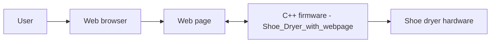

<div align="center">

# 👟 Shoe Dryer

**C++ code for a shoe dryer that can be monitored and controlled through a web page.**

<p>
  
  
</p>

</div>

> 🛠️ A hardware and software project: code for a shoe dryer with a web interface.

## 📑 Table of Contents

- [📖 About](#about)
- [🏗️ Architecture](#architecture)
- [✨ Features](#features)
- [🛠️ Tech Stack](#tech-stack)
- [🚀 Getting Started](#getting-started)
- [👤 Author](#author)

## 📖 About

- This repository contains the code for a shoe dryer with a web page.
- All of the code lives in the `Shoe_Dryer_with_webpage` folder.
- The microcontroller code is written in C++ and serves a web page that is used to interact with the dryer.

<!-- TODO: state which board/microcontroller is used (e.g. ESP32, Arduino) and list the hardware parts (heater, fan, sensors, relay, ...). -->

## 🏗️ Architecture



## ✨ Features

- Control the shoe dryer from a web page.
- Firmware written in C++.
- Self-contained project in a single folder.

<!-- TODO: list the concrete features of the web page (start/stop, timer, temperature display, ...). -->

## 🛠️ Tech Stack

| Area | Technologies |
| --- | --- |
| Language | C++ |
| Interface | Web page |

<!-- TODO: add the board, IDE / toolchain (e.g. Arduino IDE, PlatformIO) and any libraries used. -->

## 🚀 Getting Started

### Prerequisites

- The shoe dryer hardware, wired up as described in the code
- A C++ toolchain suited to your board

### Clone

```bash
git clone https://github.com/MriceDK/shoe-dryer.git
cd shoe-dryer/Shoe_Dryer_with_webpage
```

### Configuration

<!-- TODO: document any settings that must be changed before uploading, such as Wi-Fi SSID/password and pin assignments. -->

### Upload and run

<!-- TODO: add the exact steps to compile and upload the code to the board, and how to find the web page address afterwards. -->

## 👤 Author

| Name | GitHub | LinkedIn |
| --- | --- | --- |
| Maurice De Kegel | [MriceDK](https://github.com/MriceDK) | [LinkedIn](https://www.linkedin.com/in/dekegelmaurice/) |
