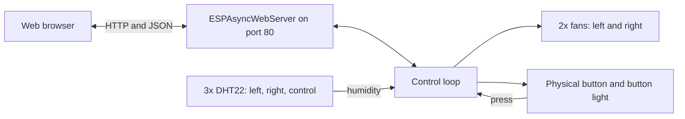

<div align="center">

# 👟 Shoe Dryer

**An ESP32 shoe dryer that switches its fans on and off based on humidity readings, with a physical button and a web interface.**

<p>
  
  
  
  
  
  
</p>

</div>

> 🛠️ A hardware and software project: firmware and web interface for a shoe dryer.

## 📑 Table of Contents

- [📖 About](#about)
- [🏗️ Architecture](#architecture)
- [✨ Features](#features)
- [🛠️ Tech Stack](#tech-stack)
- [🔌 Hardware](#hardware)
- [🚀 Getting Started](#getting-started)
- [📡 API & Infrastructure](#api--infrastructure)
- [👤 Author](#author)

## 📖 About

- This repository contains the firmware for a shoe dryer, including the web page used to control it.
- Two fans blow air through the shoes, one for the left shoe and one for the right shoe.
- Three DHT22 humidity sensors measure the humidity in the left shoe, in the right shoe and in the surrounding air (the "control" sensor).
- The fans keep running until the humidity inside a shoe has dropped to the level of the control sensor, plus a configurable margin.
- All of the code lives in the `Shoe_Dryer_with_webpage` folder. The web page is embedded in the firmware and served directly by the ESP32.

## 🏗️ Architecture



### How the drying logic works

1. The fans are started with the physical button or with the **Toggle Fans** button on the web page.
2. Starting the fans also starts the fan timer, which defaults to 5 minutes.
3. Once the timer has expired, each fan is checked separately: it is switched off when the humidity of its shoe is less than or equal to the control humidity plus the configured threshold.
4. When both fans are off, the drying cycle ends and the button light is turned off.

## ✨ Features

- Web interface with live humidity readings for the left shoe, the right shoe and the control sensor, refreshed every 2 seconds.
- Manual fan toggle from both the web page and the physical button, with a light inside the button that shows when the fans are running.
- Configurable humidity difference required before a fan switches off.
- Configurable fan timer that has to pass before the humidity check starts.
- Each fan switches off on its own, so the drier shoe does not keep running.
- Button debouncing and simple request locking (HTTP 429) to keep the web server stable.
- Responsive page that works on both desktop and mobile.

## 🛠️ Tech Stack

| Area | Technologies |
| --- | --- |
| Language | C++ (Arduino framework) |
| Microcontroller | ESP32 |
| Web server | ESPAsyncWebServer |
| Serialization | ArduinoJson 6.x |
| Sensors | DHT sensor library, DHT22 |
| Frontend | HTML, CSS and JavaScript, embedded in the firmware |

## 🔌 Hardware

| Component | Quantity | GPIO pin |
| --- | --- | --- |
| DHT22 humidity sensor, left shoe | 1 | 25 |
| DHT22 humidity sensor, right shoe | 1 | 26 |
| DHT22 humidity sensor, control (ambient) | 1 | 33 |
| Fan, left | 1 | 18 |
| Fan, right | 1 | 19 |
| Push button (`INPUT_PULLUP`, pressed = `LOW`) | 1 | 27 |
| Button light | 1 | 23 |

<!-- TODO: add the exact board model, how the fans are driven (relay or transistor) and their power supply, and a wiring diagram or photo of the finished build. -->

## 🚀 Getting Started

### Prerequisites

- An ESP32 board wired up as described in [Hardware](#hardware)
- A toolchain for the ESP32, such as the Arduino IDE or PlatformIO
- The following libraries:
  - `DHT sensor library`
  - `ESPAsyncWebServer` (and its `AsyncTCP` dependency)
  - `ArduinoJson`, **version 6.x**

### Clone

```bash
git clone https://github.com/MriceDK/shoe-dryer.git
cd shoe-dryer/Shoe_Dryer_with_webpage
```

### Configuration

Set your WiFi credentials at the top of the sketch before uploading:

| Variable | Description |
| --- | --- |
| `ssid` | Name of the WiFi network the ESP32 connects to. |
| `password` | Password of that WiFi network. |

### Upload and run

1. Open the sketch from the `Shoe_Dryer_with_webpage` folder in your IDE.
2. Select your ESP32 board and port, then upload the sketch.
3. Open the serial monitor at `9600` baud. Once the ESP32 has connected to WiFi, it prints its IP address.
4. Open that IP address in a browser on the same network to reach the web interface.

## 📡 API & Infrastructure

### API Endpoints

The web page talks to the ESP32 through these routes, which you can also call yourself.

| Method | Route | Description |
| --- | --- | --- |
| `GET` | `/` | Serves the web interface. |
| `GET` | `/data` | Returns the three humidity readings (`humidity1` left, `humidity2` right, `humidity3` control) and both fan states as JSON. A sensor that cannot be read is reported as `-1`. |
| `GET` | `/status` | Returns only the left and right fan states as JSON. |
| `GET` | `/toggle` | Toggles both fans on or off and returns the new fan states as JSON. |
| `GET` | `/setThreshold?threshold=<value>` | Sets the humidity difference required before a fan switches off. |
| `GET` | `/setTimer?timer=<minutes>` | Sets the fan timer in minutes, then redirects to `/`. |

Requests to `/data`, `/status`, `/toggle` and `/setThreshold` return `429 Too many requests` while another request is still being handled.

### Infrastructure Notes

- The web server is an asynchronous `ESPAsyncWebServer` listening on port 80.
- The HTML, CSS and JavaScript of the web interface are stored in the firmware as a raw string and served from `/`.
- The sensors are read and the fan logic runs in `loop()`, so the physical button keeps working even without a WiFi connection after startup.
- Serial output at `9600` baud logs the WiFi connection, button presses and fan switch-offs.

## 👤 Author

| Name | GitHub | LinkedIn |
| --- | --- | --- |
| Maurice De Kegel | [MriceDK](https://github.com/MriceDK) | [LinkedIn](https://www.linkedin.com/in/dekegelmaurice/) |
